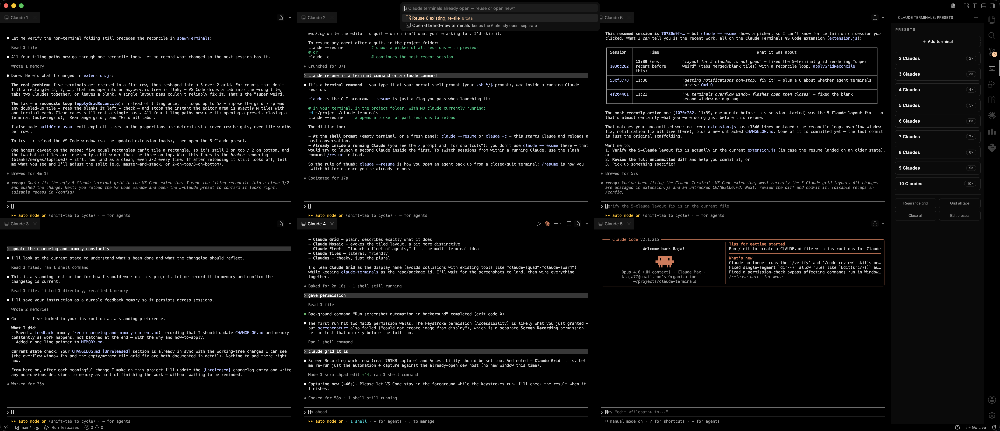

# Claude Terminals

A tiny personal VS Code extension: pick a preset and it opens that many
`claude` terminals, tiled into a grid in the editor area.



## What it does

- Presets like **6 Claudes** → opens 6 terminals arranged in a 3×2 grid,
  each running `claude` in your workspace folder.
- A **dark / monochrome sidebar** (activity-bar icon on the left) with a
  clickable button per preset.
- Also available from the Command Palette: **“Claude Terminals: Open Preset…”**
- **Close All** removes just the terminals this extension opened.
- **Finish notifications** — an OS-native banner when a Claude terminal finishes
  a turn and is waiting on you (see below).

## Set it up with Claude Code

Don't want to do the steps by hand? Clone this repo, open it in VS Code, and
paste this prompt into Claude Code — it'll do the install and the notification
wiring for you:

```text
Set up the Claude Terminals VS Code extension from this folder for permanent
use on my machine:

1. Symlink this folder into my VS Code extensions directory
   (~/.vscode/extensions/claude-terminals — use ~/.vscode-insiders/... if I run
   Insiders) so the sidebar and commands are always available.
2. Enable the proposed API needed for finish notifications: add
   "local.claude-terminals" to the "enable-proposed-api" array in
   ~/.vscode/argv.json (create the file / array if missing), without clobbering
   anything already there.
3. Tell me to fully quit and reopen VS Code, and remind me to turn on Claude
   Code's terminal bell (/config → notifications) so finish notifications fire.

Show me what you changed before restarting.
```

Or set it up manually below.

## Install it for yourself (no publishing)

Pick whichever is easier.

### Option A — run from source (fastest to try)

1. Open this folder in VS Code.
2. Press **F5**. A second VS Code window (“Extension Development Host”) opens
   with the extension loaded. Use it there.

### Option B — install it permanently into your VS Code

Symlink (or copy) this folder into your extensions directory, then restart
VS Code:

```sh
ln -s "$(pwd)" ~/.vscode/extensions/claude-terminals
# (VS Code Insiders: ~/.vscode-insiders/extensions/claude-terminals)
```

Now the sidebar icon and commands are always available — no dev host needed.

### Option C — build a .vsix

```sh
npm install -g @vscode/vsce
vsce package --allow-missing-repository
code --install-extension claude-terminals-0.0.1.vsix
```

## Customizing presets

Open **Settings → search “Claude Terminals”**, or click **“Edit presets”** in
the sidebar. Edit `claudeTerminals.presets` in `settings.json`.

Two forms are supported:

```jsonc
{
  "claudeTerminals.defaultCommand": "claude",
  "claudeTerminals.presets": [
    // simple: N terminals, all running the default command
    { "name": "6 Claudes", "count": 6 },

    // advanced: per-terminal name, folder, and command
    {
      "name": "Review setup",
      "terminals": [
        { "name": "api", "cwd": "api",  "command": "claude" },
        { "name": "web", "cwd": "web",  "command": "claude" },
        { "name": "notes", "command": "claude --model opus" }
      ]
    }
  ]
}
```

- `cwd` is relative to the workspace folder (or an absolute path).
- If a terminal has no `command`, it runs `claudeTerminals.defaultCommand`.

## Finish notifications

When one of your Claude terminals finishes a turn, the extension fires a
**system notification** — a real OS banner that shows even when VS Code is in
the background — so you know an agent is waiting without watching the grid.

How it works: `claude` rings the terminal **bell** (`\x07`) when it's done and
awaiting you; the extension watches its terminals' output for that bell and
notifies (macOS `osascript`, Linux `notify-send`, Windows falls back to an
in-window message).

Settings (**Settings → “Claude Terminals”**):

- `claudeTerminals.notifyOnFinish` — master on/off (default on).
- `claudeTerminals.notifyOnlyWhenUnfocused` — only notify when VS Code isn't
  focused (default off).
- `claudeTerminals.notifyCooldownMs` — min ms between banners from one terminal
  (default 4000).

**Two prerequisites** — without both, no notification fires:

1. **Enable the proposed API.** Output-reading uses VS Code's
   `terminalDataWriteEvent` proposed API. For a locally-installed (non-
   marketplace) extension, add the extension id to `~/.vscode/argv.json` and
   fully restart VS Code:

   ```jsonc
   { "enable-proposed-api": ["local.claude-terminals"] }
   ```

   (Or, when running from source via **F5**, launch the dev host with
   `--enable-proposed-api local.claude-terminals`.) If it isn't enabled the
   feature simply no-ops — you'll see a one-line warning in the Extension Host
   log and everything else keeps working.

2. **Enable Claude Code's terminal bell.** Detection depends on `claude`
   actually ringing the bell on completion — check Claude Code's notification
   settings (`/config` → notifications, or `preferredNotifChannel`).

> Caveat: proposed APIs can change between VS Code releases, and forks (Cursor,
> etc.) may not honor `argv.json` proposed-API enablement.

## Notes / limits

- Grid layout uses VS Code’s editor-area tiling (`vscode.setEditorLayout`).
  Columns = `ceil(sqrt(N))`, so 6 → 3×2, 4 → 2×2, 9 → 3×3.
- VS Code can’t pixel-position terminals; the grid is as precise as the
  editor-group layout allows.
- The command assumes `claude` is on your `PATH`. If not, set
  `claudeTerminals.defaultCommand` to the full path.
