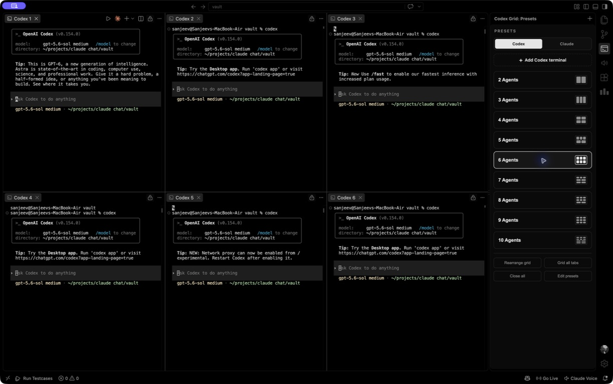

# Codex Grid

A tiny personal VS Code extension: pick a preset and it opens that many
agent terminals, tiled into a grid in the editor area. Codex is the default;
use the sidebar switch whenever you want Claude instead.

### Codex (default)



### Claude (optional)


## What it does

- Presets like **6 Agents** → opens 6 terminals arranged in a 3×2 grid,
  each running `codex` in your workspace folder by default.
- A **Codex / Claude switch** in the sidebar changes what presets and the add
  button launch. Explicit per-preset commands still win.
- A **dark / monochrome sidebar** (activity-bar icon on the left) with a
  clickable button per preset.
- Also available from the Command Palette: **“Codex Grid: Open Preset…”**
- **Close All** removes just the terminals this extension opened.
- **Finish notifications** — an OS-native banner when an agent terminal finishes
  a turn and is waiting on you (see below).

## Prerequisites

Install Codex CLI on macOS or Linux with OpenAI's standalone installer:

```sh
curl -fsSL https://chatgpt.com/codex/install.sh | sh
```

Open a new terminal, run `codex`, and sign in the first time. Claude remains an
optional alternative and must be installed separately if you use that switch.

## Set up the extension with an agent

Don't want to do the steps by hand? Clone this repo, open it in VS Code, and
paste this prompt into Codex or Claude Code — it'll do the extension install and
notification wiring for you:

```text
Set up the Codex Grid VS Code extension from this folder for permanent
use on my machine:

1. Symlink this folder into my VS Code extensions directory
   (~/.vscode/extensions/claude-terminals — use ~/.vscode-insiders/... if I run
   Insiders, or ~/.cursor/extensions/... if I run Cursor) so the sidebar and
   commands are always available.
2. Enable the proposed API needed for finish notifications: add
   "local.claude-terminals" to the "enable-proposed-api" array in
   ~/.vscode/argv.json (~/.cursor/argv.json on Cursor; create the file / array
   if missing), without clobbering anything already there.
3. Tell me to fully quit and reopen the editor. If I use Claude, remind me to
   turn on its terminal bell (/config → notifications) for finish notifications.

Show me what you changed before restarting.
```

Or set it up manually below.

## Install it for yourself (no publishing)

Pick whichever is easier.

### Option A — run from source (fastest to try)

1. Open this folder in VS Code.
2. Press **F5**. A second VS Code window (“Extension Development Host”) opens
   with the extension loaded. Use it there.

### Option B — install it permanently into your VS Code

Symlink (or copy) this folder into your extensions directory, then restart
VS Code:

```sh
ln -s "$(pwd)" ~/.vscode/extensions/claude-terminals
# (VS Code Insiders: ~/.vscode-insiders/extensions/claude-terminals)
# (Cursor:         ~/.cursor/extensions/claude-terminals)
```

Now the sidebar icon and commands are always available — no dev host needed.

### Option C — build a .vsix

```sh
npm install -g @vscode/vsce
vsce package --allow-missing-repository
code --install-extension claude-terminals-0.0.1.vsix
```

## Customizing presets

Open **Settings → search “Codex Grid”**, or click **“Edit presets”** in
the sidebar. Edit `claudeTerminals.presets` in `settings.json`.

Two forms are supported:

```jsonc
{
  "claudeTerminals.agent": "codex",
  "claudeTerminals.codexCommand": "codex",
  "claudeTerminals.claudeCommand": "claude",
  "claudeTerminals.presets": [
    // simple: N terminals, all running the default command
    { "name": "6 Agents", "count": 6 },

    // advanced: per-terminal name, folder, and command
    {
      "name": "Review setup",
      "terminals": [
        { "name": "api", "cwd": "api",  "command": "claude" },
        { "name": "web", "cwd": "web",  "command": "claude" },
        { "name": "notes", "command": "claude --model opus" }
      ]
    }
  ]
}
```

- `cwd` is relative to the workspace folder (or an absolute path).
- If a terminal or preset has an explicit `command`, that command wins.
- Otherwise it runs `codexCommand` or `claudeCommand` for the selected agent.

## Finish notifications

When one of your agent terminals emits a terminal bell, the extension fires a
**system notification** — a real OS banner that shows even when VS Code is in
the background — so you know an agent is waiting without watching the grid.

How it works: the extension watches its terminals' output for the **bell**
(`\x07`) and notifies (macOS `osascript`, Linux `notify-send`, Windows falls
back to an in-window message).

Settings (**Settings → “Codex Grid”**):

- `claudeTerminals.notifyOnFinish` — master on/off (default on).
- `claudeTerminals.notifyOnlyWhenUnfocused` — only notify when VS Code isn't
  focused (default off).
- `claudeTerminals.notifyCooldownMs` — min ms between banners from one terminal
  (default 4000).

**Two prerequisites** — without both, no notification fires:

1. **Enable the proposed API.** Output-reading uses VS Code's
   `terminalDataWriteEvent` proposed API. For a locally-installed (non-
   marketplace) extension, add the extension id to `~/.vscode/argv.json` and
   fully restart VS Code:

   ```jsonc
   { "enable-proposed-api": ["local.claude-terminals"] }
   ```

   (Or, when running from source via **F5**, launch the dev host with
   `--enable-proposed-api local.claude-terminals`.) If it isn't enabled the
   feature simply no-ops — you'll see a one-line warning in the Extension Host
   log and everything else keeps working.

2. **Enable a terminal bell in the selected CLI.** For Claude Code, check
   `/config` → notifications (or `preferredNotifChannel`). If the CLI does not
   emit a bell, the grid still works but finish notifications will not fire.

> Caveat: proposed APIs can change between VS Code releases, and forks may lag
> behind on them.

## Cursor

Cursor is a VS Code fork, so everything works the same — only the paths change.
It keeps extensions in `~/.cursor/extensions` and reads `~/.cursor/argv.json`:

```sh
ln -s "$(pwd)" ~/.cursor/extensions/claude-terminals
```

```jsonc
// ~/.cursor/argv.json
{ "enable-proposed-api": ["local.claude-terminals"] }
```

Then fully quit and reopen Cursor (⌘Q — a window reload won't re-read
`argv.json`). Cursor ships the `terminalDataWriteEvent` proposal, so finish
notifications work there too; if a future Cursor build drops it, the extension
just no-ops that feature and the grid keeps working.

## Notes / limits

- Grid layout uses VS Code’s editor-area tiling (`vscode.setEditorLayout`).
  Columns = `ceil(sqrt(N))`, so 6 → 3×2, 4 → 2×2, 9 → 3×3.
- VS Code can’t pixel-position terminals; the grid is as precise as the
  editor-group layout allows.
- The selected command must be on your `PATH`. If needed, set
  `claudeTerminals.codexCommand` or `claudeTerminals.claudeCommand` to its full
  path.
